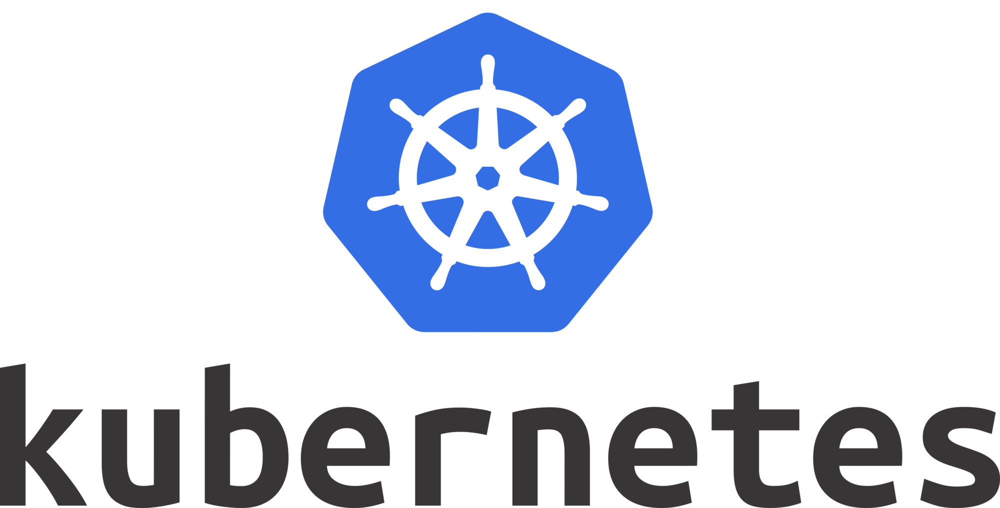

# Kubernetes-green

Este es un repo-curso para aprender a utilizar Kubernetes. Los temas se encuentran divididos en carpetas para su rapida aplicacion.

Kubernetes es una plataforma portable y extensible de código abierto para administrar cargas de trabajo y servicios. Kubernetes facilita la automatización y la configuración declarativa. Tiene un ecosistema grande y en rápido crecimiento. El soporte, las herramientas y los servicios para Kubernetes están ampliamente disponibles.

# ¿Por qué necesito Kubernetes y qué puede hacer por mi?

Kubernetes tiene varias características. Puedes pensar en Kubernetes como:

- una plataforma de contenedores.
- una plataforma de microservicios.
- una plataforma portable de nube.

y mucho más.

# Referencias.

[Pablokbs](https://github.com/pablokbs/peladonerd)
